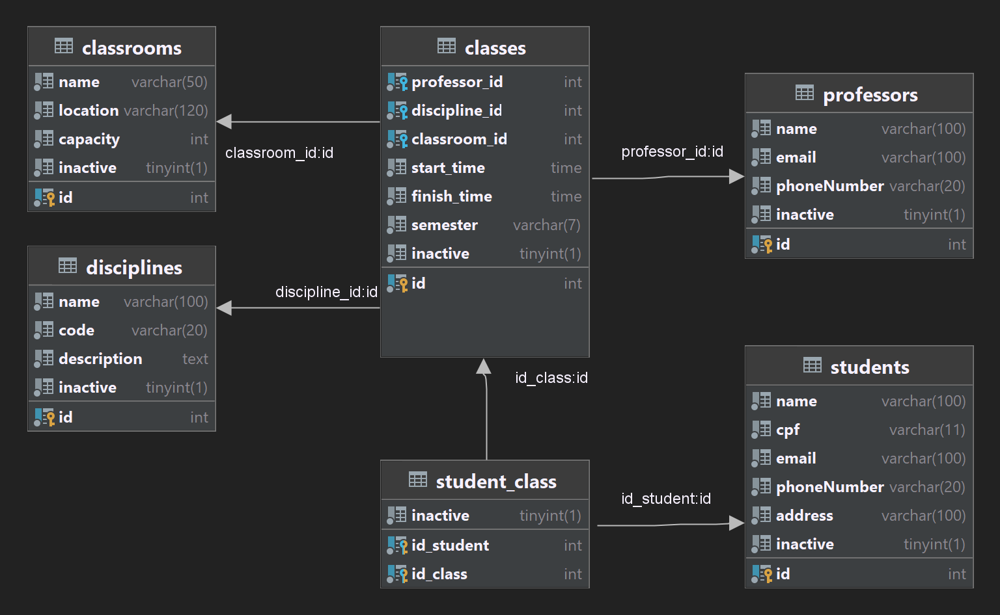
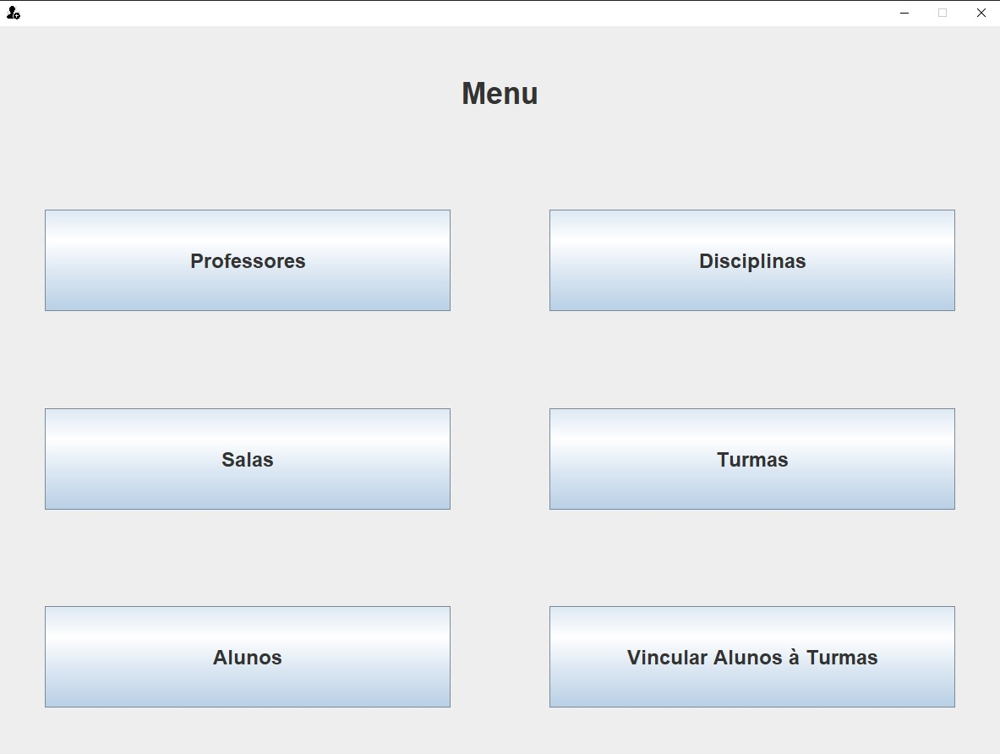
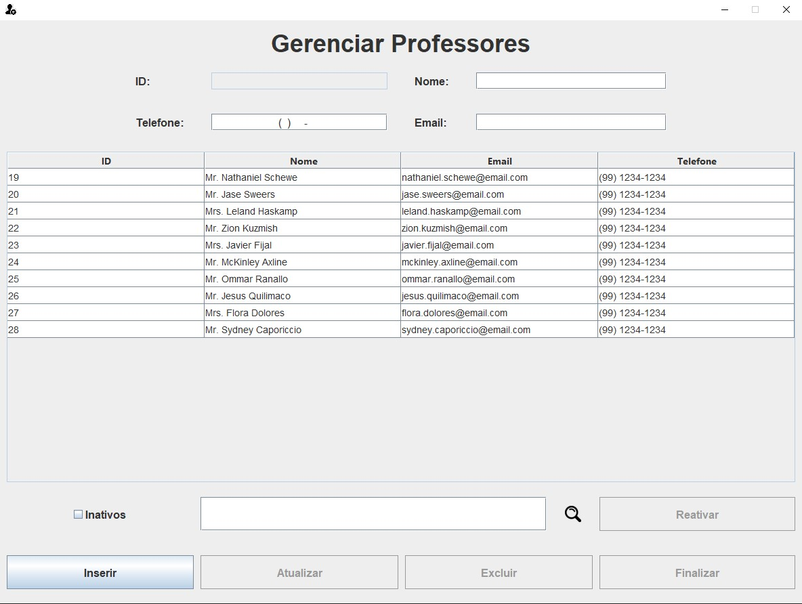
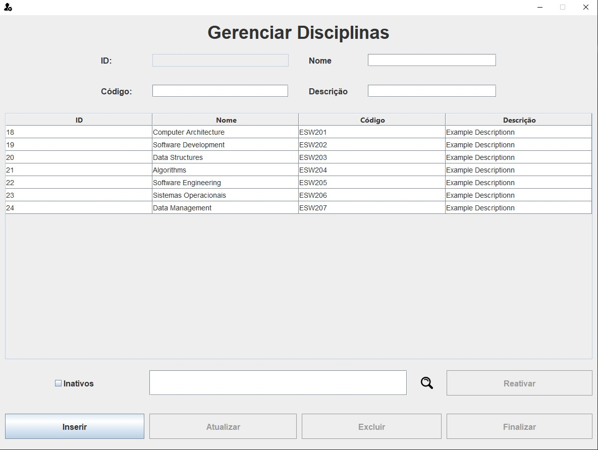
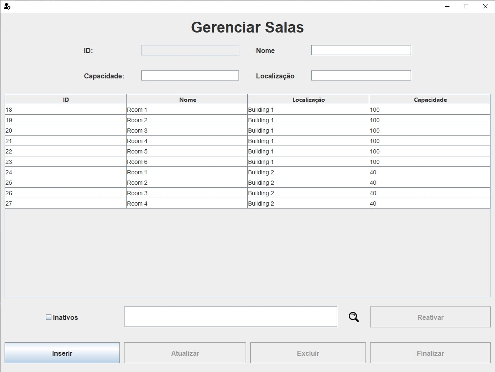
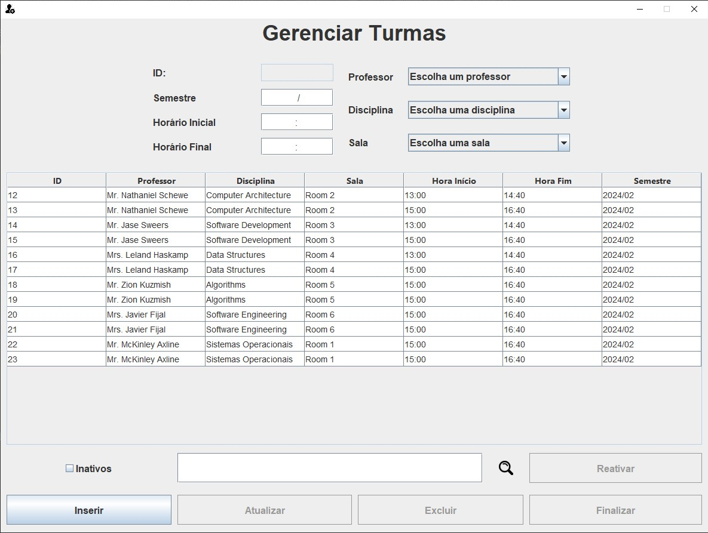
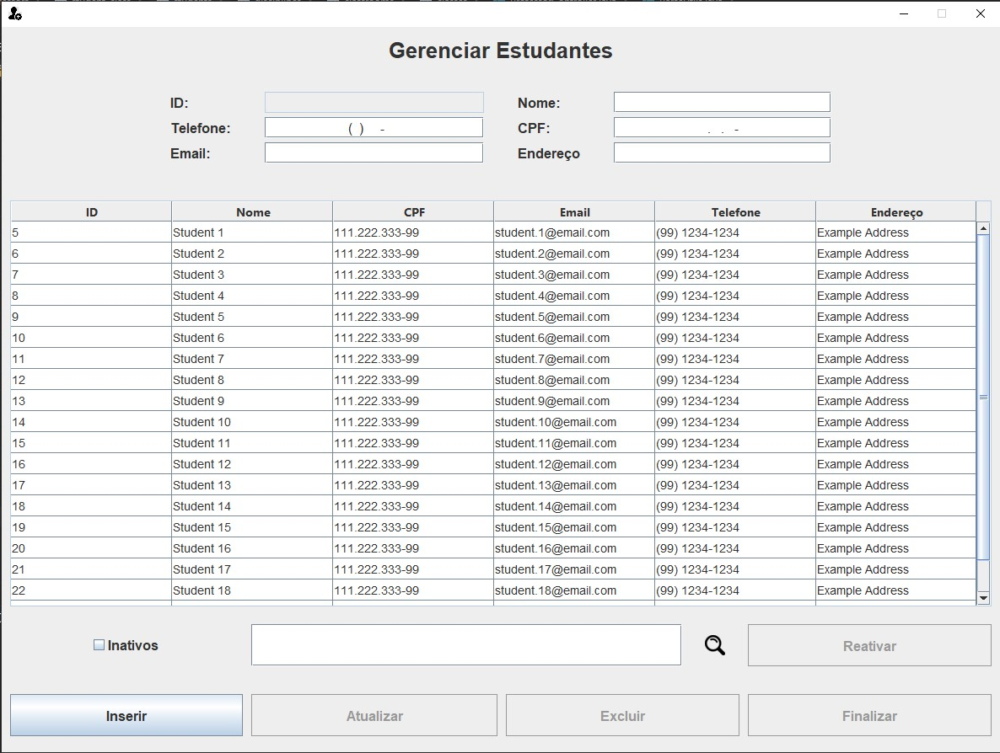
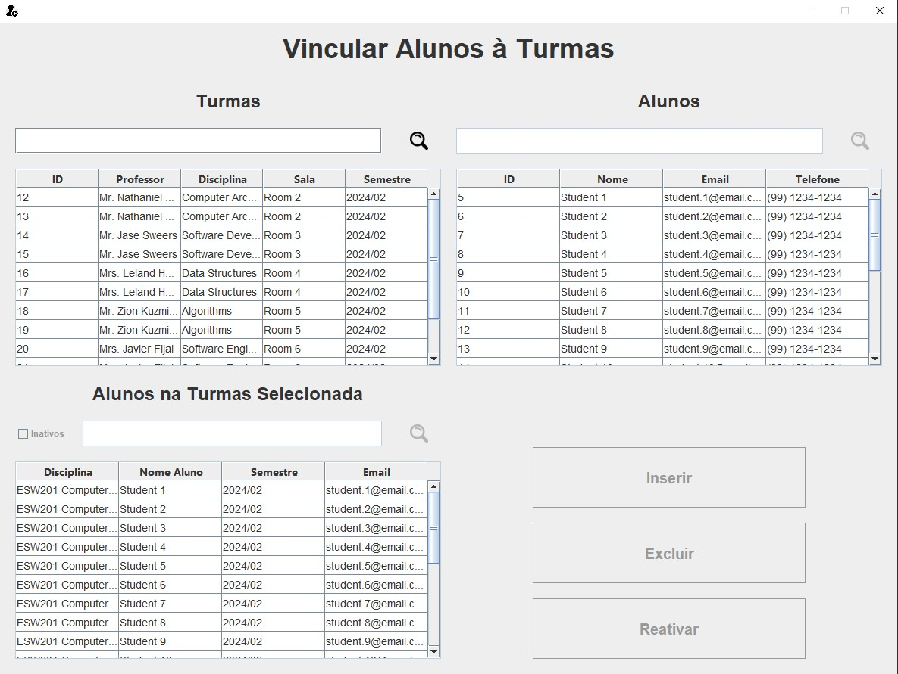

# Class Maker

Our professor assigned us the task of developing a comprehensive software application aimed at assisting a school director in managing various aspects of the educational institution.  
The application will allow the director to efficiently handle the following entities:  

* **Students:** Register new students and maintain their past subjects.  
* **Professors:** Add new professors and manage their profiles and subjects.  
* **Disciplines:** Create and organize the different subjects offered by the school.  
* **Classrooms:** Set up and manage classrooms available for instruction.  
* **Classes:** Create class schedules and enroll students in them.   

The application was implemented using Java, MySQL for database management, and Java Swing for the Graphical User Interface. It follows the Model-View-Controller (MVC) architecture and makes use of dependency injection for the model, service and view, which enhances modularity and future testability of the application.  

## Entity Relationship Diagram

## GUIs
### Menu

### Professors

### Disciplines

### Classrooms

### Classes

### Students

### Assign Students to Classes
